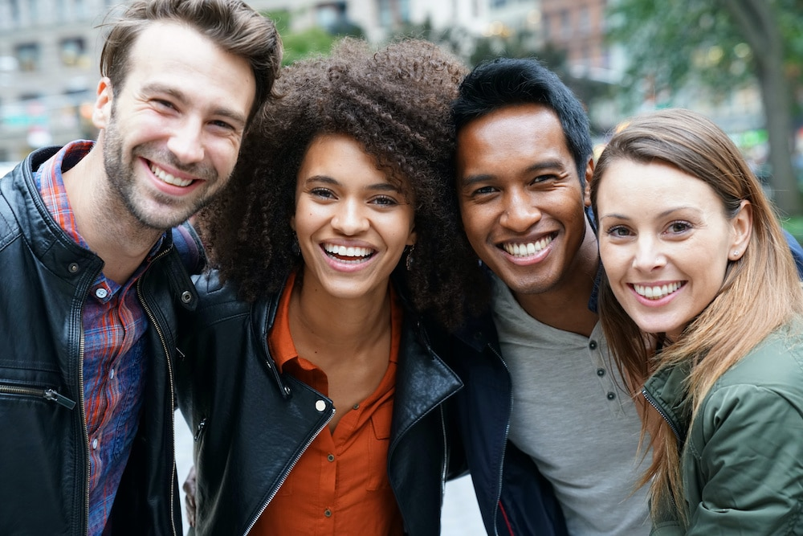

# Object Detections Using Yolo

**To do this challenge, you need a basic understanding of Yolov3 Algorithm and CV2 Module.**

## The challenge

My challenge is to Write a Code to detect objects in the Given image .

With the help of using Yolov3 Algorithm we can complete this Challenge.

In Yolov3 algorithm we are having a CFG Folder in that Folder we have:

- Yolov3-tiny.cfg
- Yolove.cfg

## coco.names :
- In this File we have 81 Object names we can find these objects by using the Yolov3 Algorithm

# Image After Object Detection Will be Like This :

