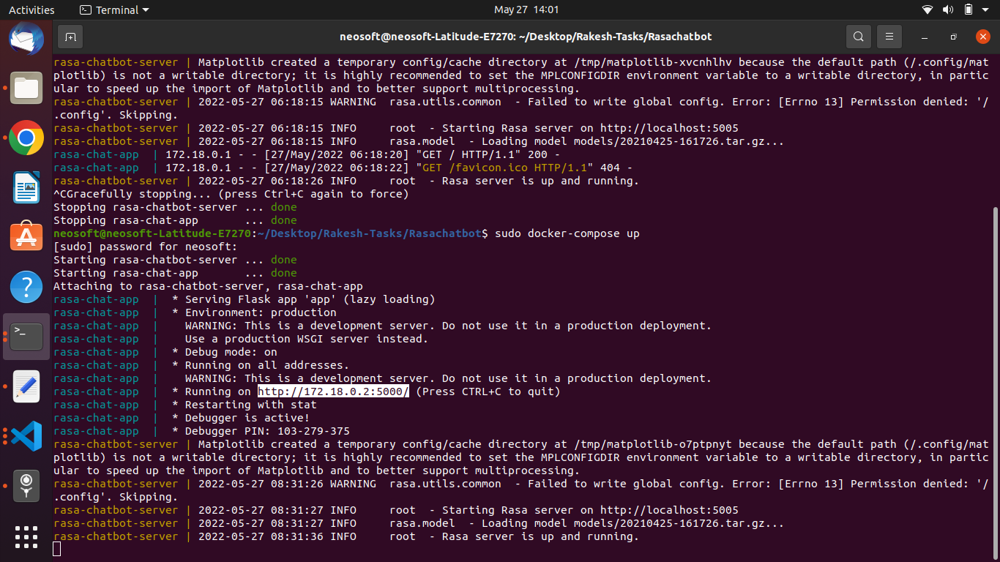
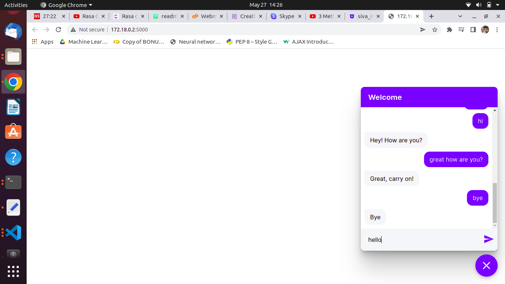

# Project Title
Rasa Chatbot

# Description
Build and Deploy RASA Chatbot on Website

## Requirements

- rasa_nlu[spacy]
- nltk
- numpy
- pandas
- scikit-learn
- flask
- gunicorn
- tornado


    
## Commands we need to execute this Rasa chatbot Project

Build Rasa chatbot using this command

```bash
  docker-compose build
```
Run Rasa chatbot

```bash
  docker-compose up
```
## Execute the Rasa chatbot in this way

After running Docker container a link will appear as shown in the image


## After opening that link we can see a messagebox at the bottom end of the webpage as shown in the image


### click on messagebox and send message it will give reply as shown in the image



In this way we will run this Rasa Chatbot Project


## Roadmap

- Install Rasa
- creating a webpage where user interact with Chatbot
- Rasa webchat bot Integration with our Website
- Use Rasa Server and socket io to get the answer from the Rasa core.
- Create a Dockerfile to build an Image
- Creating a docker-compose file for host on docker


## Acknowledgements

 - [A chat widget to deploy virtual assistants made with Rasa or Botfront on any website.](https://github.com/botfront/rasa-webchat#as-a-react-component)


## It's good to understand what some of these files are for. So as a quick overview:

- The 'domain.yml' file is the file where everything comes together.
- The config.yml file contains the configuration for your machine learning models.
- The data folder contains data that your assistant will learn from.
- The nlu.yml file contains examples for your intents and entities.
- The stories.yml file contains examples of conversations turns.
- The rules.yml file contains predefined rules for the dialogue policies.
All of these files will be explained in more detail later, but these five files play an especially crucial part in developing Rasa assistant. So it's good to be concious of them right away.


