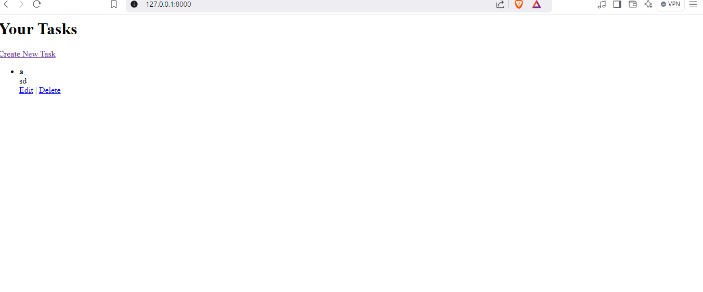

Follow the steps below to set up the project locally:

1. Create a Virtual Environment
Create a virtual environment for the project using the following command:

python -m venv task_manager_env

2. Activate the Virtual Environment
Activate the virtual environment using the appropriate command:

On Windows:

task_manager_env\Scripts\activate

3. Install Required Packages
With the virtual environment activated, install the required packages listed in requirements.txt:

pip install -r requirements.txt

4. Configure Google OAuth
To enable Google authentication, you'll need to configure Google OAuth credentials in your settings.py file.

Visit the Google Developer Console.
Create a new project.
Enable the "Google Identity Platform" and create OAuth 2.0 credentials.
Add your Client ID and Client Secret to the following section in settings.py:

SOCIAL_AUTH_GOOGLE_OAUTH2_KEY = 'your-client-id.apps.googleusercontent.com'
SOCIAL_AUTH_GOOGLE_OAUTH2_SECRET = 'your-client-secret'

5. Check Migrations and Apply Them
Run the following commands to check and apply the migrations to set up your database:

python manage.py makemigrations
python manage.py migrate

6. Create a Superuser
If you haven't created a superuser to log in to the Django admin panel, create one with the following command:

python manage.py createsuperuser
Follow the prompts to create the superuser.

7. Run the Development Server
Once the migrations are applied and the superuser is created, you can run the development server:

python manage.py runserver
The app will be accessible at http://127.0.0.1:8000/.

8. Admin Panel
Customize the admin panel to manage tasks and send user invitations. Access the Django admin panel at:

http://127.0.0.1:8000/admin/
Log in with the superuser credentials you created.

## Screenshots

